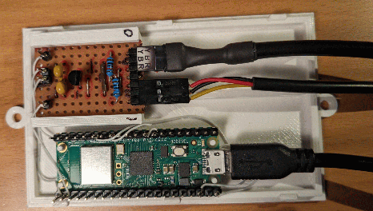
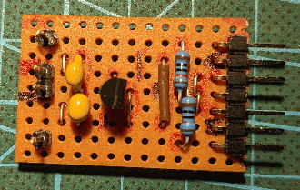
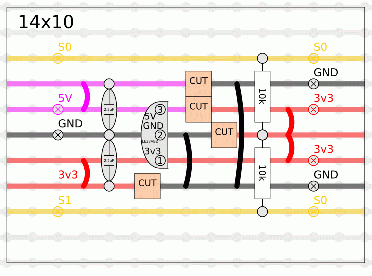

# DS18B20
Use a Raspberry Pi Pico W to read a DS18B20 Temperature sensor and publish data using MQTT.

The code is written in MicroPython and the basic structure of it is copied from https://github.com/HenrikSolver/picowhanport.

The casing of the unit is modelled in OpenScad and the STL of the bottom and the top cover are in this git.

The PCB takes 5V from the Pico PIN40 VBUS and GND from PIN38 and supplies the 1-Wire sensors with 3v3 using a 100mA regulator.

The schematics also show how the strapping of the "ID pins", giving the unit an ID number (0..15) and the "Delay Pins" controlling the measuring interval of the unit.

Files:
| File | Description |
| --- | --- |
| config.py | WLAN and MQTT configuration. |
| boot.py | Just direct execution to main.py. |
| main.py | Main code |
| DS18B20SBS-B.stl | Bottom casing for Pico and PCB |
| DS18B20SBS-top-B.stl | Top casing for Pico and PCB |

## Python Code
You need to edit `config.py` to correcpond to the SSID and PSK of your WLAN.  `MQTTHost` need to be updated to the IP number of your broker to use.

Note that the code (`main.py`) is made to read two independent
one-wire interfaces fed using a 3v3 regulator.  If you only need one,
you need to edit the code.  Depending on your number of sensors, the
Pico's build-in 3v3 might just be able to handle a sensor or two,
depending on the brand of sensor and cable lengths.
Using two different 1-Wire interfaces and the 3v3 regulator greatly
improves the stability of the unit.

The "ID Pins" and the "Delay Pins" are only used at boot time, they are then turned off.

